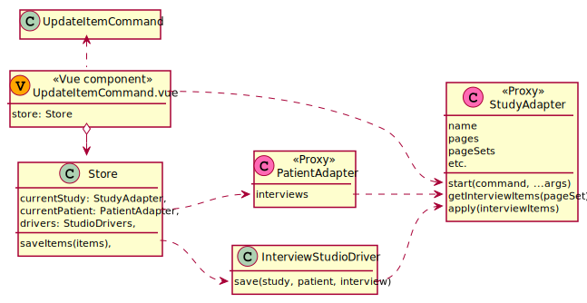

## Command components

Each command will have its own component which is responsible of calling the `StudyAdapter` `start` method with the appropriate values. This component will be adequately positioned in the `PageItem.vue` component in studio mode.

`AcknowledgeInput.vue` should display a more suitable form for the `"__APPLY__"` item, like a `"Save"` button. The component should leverage the `.studioApply` modifier class. This component may contain a `"Cancel"` button which calls `start(NullCommand)` on the `StudyAdapter`.

All studio behavior should be implemented in dedicated components eventually imported in other components. For example `AcknowledgeInput.vue` should import a `StudioApplyInput.vue` component that display a `"Save"` button, located in a specific directory.

## 2 phases mutation
**Setup** : encapsulate the client drivers in a `StudioDrivers` instance

 &emsp; In the store, settings module, add a pair of getter / setter : `isStudioMode` / `setStudioMode(boolean)`.\
 &emsp; When `isStudioMode` is `true`, the `drivers` getter encapsulates the `ClientDrivers` instance in a `StudioDriver` instance.\
 &emsp; Then the `currentStudy` and `currentPatient` getters will return `StudyAdapter` and `PatientAdapter` instances.

**Phase 1** : start a command (will mutate the current study to add specific studio items).

 &emsp; In a vue component dedicated to each `ICommandMutation` implementor,\
 &emsp; call the `currentStudy.start` method on some event (i.e. a button click).

**Phase 2** : set the apply marker to true and save the items with studio drivers

 &emsp; It will be automatically triggered when `__APPLY__` variable is set to `true`.\
 &emsp; A variation of component `AcknowledgeInput` dedicated to studio mode should be used.

**Cancel** :

 &emsp; In a reusable vue component, call the `currentStudy.start` method with the `NullCommand` type on some event (i.e. a button click).